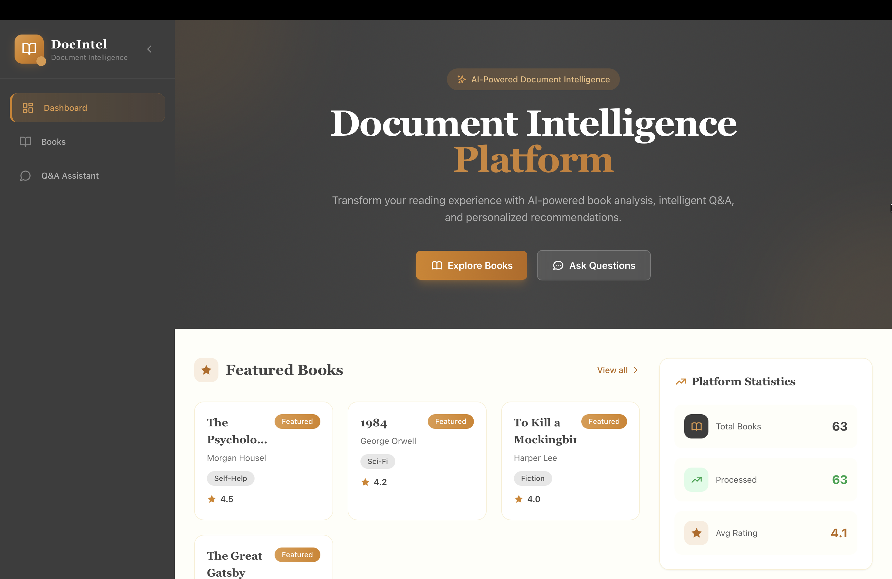
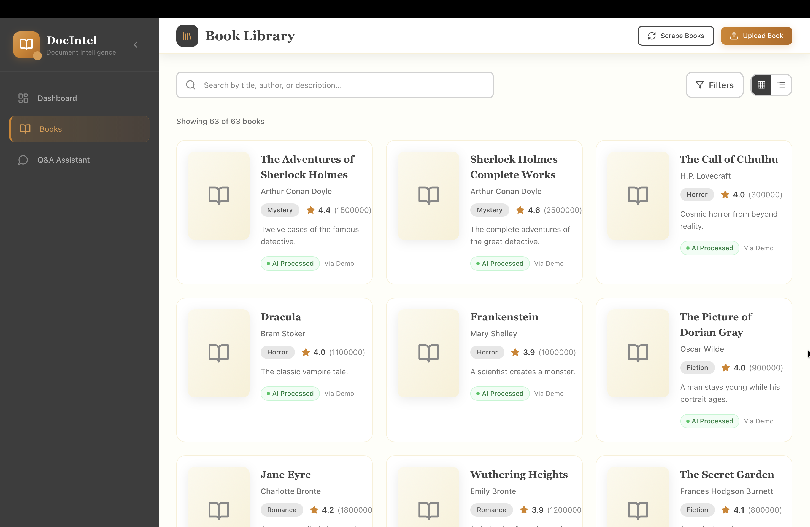
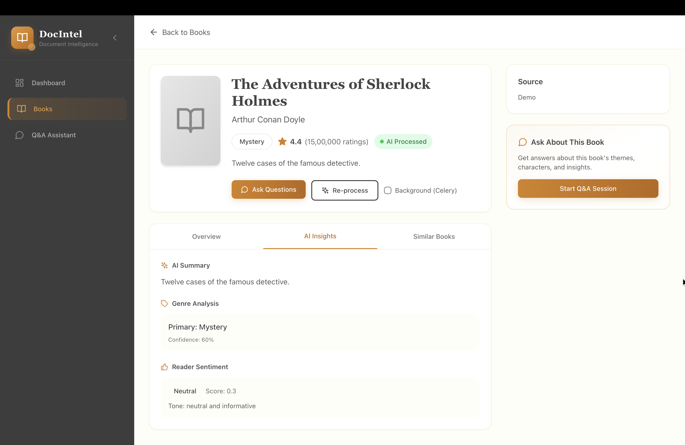
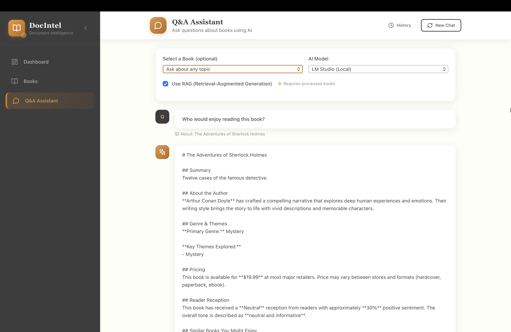

# Document Intelligence Platform


A full-stack web application with AI/RAG integration for processing book data and enabling intelligent querying. Features include book management, AI-powered insights (summaries, genre classification, sentiment analysis), an intelligent Q&A system, book recommendations, and web scraping capabilities.

---

## Screenshots

> **Note:** To add screenshots, run the application and take screenshots of the following pages. Save them to `docs/images/`:
> - `dashboard.png` - Dashboard page (http://localhost:3000)
> - `books.png` - Book library (http://localhost:3000/books)
> - `book-detail.png` - Book detail (http://localhost:3000/books/1)
> - `qa.png` - Q&A interface (http://localhost:3000/qa)

### Dashboard

*The main dashboard displays platform statistics, featured books, and system health status.*

### Book Library

*Browse, search, and filter your book collection with beautiful card-based layouts.*

### Book Detail

*View detailed book information including AI-generated insights, price, and recommendations.*

### Q&A Interface

*Ask questions about books and get contextual, AI-powered answers.*

---

## Features

- **Book Management**: Upload, scrape, and manage book collections
- **AI-Powered Insights**: Generate summaries, genre classification, sentiment analysis
- **RAG Pipeline**: Question-answering over book content with source citations
- **Book Recommendations**: AI-driven similar book suggestions
- **Web Scraping**: Automated book data collection from Goodreads, Amazon, Open Library
- **Modern UI**: Professional gold, cream, black and white themed interface
- **Background Processing**: Celery-powered async task processing
- **Redis Caching**: Persistent caching layer for fast responses
- **Chat History**: Save and retrieve conversation sessions

---

## Tech Stack

### Backend
| Technology | Purpose |
|------------|---------|
| Django REST Framework | REST API backend |
| SQLite | Primary database (MySQL supported) |
| ChromaDB | Vector database for embeddings |
| Celery | Background task processing |
| Redis | Caching and message broker |
| Selenium | Web scraping automation |
| Sentence Transformers | Embedding generation |
| LM Studio | Local LLM (no API costs) |

### Frontend
| Technology | Purpose |
|------------|---------|
| Next.js 14 | React framework with App Router |
| Tailwind CSS | Professional gold/cream theme |
| Zustand | State management |
| React Hot Toast | Notifications |

---

## Quick Start

### Option 1: Docker Compose (Recommended)

```bash
# Clone the repository
git clone https://github.com/madiredypalvasha-06/document-intelligence-platform.git
cd document-intelligence-platform

# Start all services (includes Redis, Celery worker, beat)
docker-compose up --build

# Access the application
# Frontend: http://localhost:3000
# Backend API: http://localhost:8000/api/
```

### Option 2: Manual Setup

#### Backend Setup

```bash
cd backend

# Create virtual environment
python -m venv venv
source venv/bin/activate  # On Windows: venv\Scripts\activate

# Install dependencies
pip install -r requirements.txt

# Run migrations
python manage.py migrate

# Start the server
python manage.py runserver

# In another terminal, start Celery worker (for background tasks)
celery -A books worker --loglevel=info

# In another terminal, start Celery beat (for scheduled tasks)
celery -A books beat --loglevel=info
```

#### Frontend Setup

```bash
cd frontend

# Install dependencies
npm install

# Start the development server
npm run dev
```

---

## LM Studio Setup (Recommended)

For AI features without external API costs:

1. Download [LM Studio](https://lmstudio.ai/)
2. Download a model (e.g., Llama 2, Mistral, Phi-2)
3. Start the local server (click "Start Server" in LM Studio)
4. The platform will automatically connect to `http://localhost:1234`

---

## API Documentation

### Base URL
```
http://localhost:8000/api/
```

### Books API

| Method | Endpoint | Description |
|--------|----------|-------------|
| GET | `/books/` | List all books (paginated) |
| GET | `/books/{id}/` | Get book details |
| POST | `/books/upload/` | Upload a book |
| POST | `/books/{id}/process/` | Generate AI insights (use `background=true` for Celery) |
| GET | `/books/{id}/recommendations/` | Similar books |
| GET | `/books/stats/` | Platform statistics |
| POST | `/books/load-samples/` | Load sample books |

### Q&A API

| Method | Endpoint | Description |
|--------|----------|-------------|
| POST | `/qa/` | Ask a question |
| GET | `/conversations/{session_id}/` | Chat history |

### Scraping API

| Method | Endpoint | Description |
|--------|----------|-------------|
| POST | `/scrape/` | Start scraping job |
| GET | `/scrape/` | List scraping jobs |

### Other Endpoints

| Method | Endpoint | Description |
|--------|----------|-------------|
| GET | `/favorites/` | User favorites |
| POST | `/rate/` | Rate a book |
| GET | `/search/suggestions/` | Search suggestions |
| GET | `/export/` | Export books (JSON/CSV) |
| GET | `/health/` | System health check |

### Example API Calls

```bash
# Get all books
curl http://localhost:8000/api/books/

# Get specific book
curl http://localhost:8000/api/books/1/

# Ask a question
curl -X POST http://localhost:8000/api/qa/ \
  -H "Content-Type: application/json" \
  -d '{"question": "What is the genre?", "book_id": 1}'

# Ask question with background processing
curl -X POST http://localhost:8000/api/books/1/process/ \
  -H "Content-Type: application/json" \
  -d '{"background": true}'

# Start scraping
curl -X POST http://localhost:8000/api/scrape/ \
  -H "Content-Type: application/json" \
  -d '{"source": "goodreads", "max_books": 10}'
```

---

## Sample Questions and Answers

The Q&A system gives **targeted, specific answers** for different question types:

### Who Would Enjoy This Book?
**Q:** "Who would enjoy this book?" (The Adventures of Sherlock Holmes)
```
# The Adventures of Sherlock Holmes

## Who Would Enjoy This Book

This book is perfect for **fans of detective stories, puzzle solvers, and those who love uncovering hidden clues**.

**You might enjoy this if you like:**
- Solving puzzles and uncovering secrets
- Suspenseful storytelling with unexpected twists
- Complex characters with hidden motives
```

### Price Information
**Q:** "How much is it?"
```
# The Adventures of Sherlock Holmes

## Pricing Information

**Current Price:** $19.99

This book is available at this price from most major online retailers including Amazon, Barnes & Noble, and book marketplaces.

**Note:** Prices may vary depending on:
- Format (hardcover, paperback, ebook, or audiobook)
- Retailer and any ongoing promotions
- Condition (new vs. used copies)
```

### Genre Classification
**Q:** "What genre is this?"
```
# The Adventures of Sherlock Holmes

## Genre Analysis

**Primary Genre:** Mystery
**Classification Confidence:** 60%

**Genre Indicators:**
- Mystery

This book falls primarily within the **Mystery** category, offering readers suspenseful and engaging narratives that keep you guessing.
```

### Plot Summary
**Q:** "Give me a summary"
```
# The Adventures of Sherlock Holmes

## Plot Summary

Twelve cases of the famous detective.

This summary captures the essence of the story, highlighting the main plot points and central conflict that drives the narrative forward.
```

### Author Information
**Q:** "Who is the author?"
```
# The Adventures of Sherlock Holmes

## About the Author

**Arthur Conan Doyle** is the author of "The Adventures of Sherlock Holmes".

The author's work in this book demonstrates their unique storytelling ability and narrative style. Their writing brings depth and authenticity to the characters and world they've created.

If you'd like to explore more works by this author, check out our book recommendations below.
```

---

## Project Structure

```
document-intelligence-platform/
├── backend/
│   ├── books/
│   │   ├── models.py          # Database models (Book, Review, etc.)
│   │   ├── views.py           # API endpoints
│   │   ├── serializers.py     # DRF serializers
│   │   ├── ai_services.py     # AI/LLM integration
│   │   ├── rag_pipeline.py    # RAG implementation
│   │   ├── scraper.py         # Web scraping
│   │   ├── tasks.py           # Celery background tasks
│   │   ├── cache.py           # Redis caching layer
│   │   ├── celery.py          # Celery configuration
│   │   └── middleware.py      # Rate limiting
│   ├── config/                # Django settings
│   ├── tests/                 # Unit tests
│   ├── requirements.txt      # Python dependencies
│   └── manage.py
├── frontend/
│   ├── src/
│   │   ├── app/              # Next.js pages
│   │   ├── components/        # React components
│   │   ├── lib/              # API client
│   │   └── store/            # Zustand store
│   ├── package.json
│   └── tailwind.config.js
├── docs/
│   └── USER_GUIDE.md         # Complete user guide
├── docker-compose.yml
└── README.md
```

---

## Color Theme

Professional Gold, Cream, Black & White:

| Color | Hex | Usage |
|-------|-----|-------|
| Gold | `#d4821f` | Primary accent |
| Light Gold | `#e6a54a` | Hover states |
| Cream | `#fefef9` | Background |
| Warm Cream | `#fcf9ed` | Cards |
| Obsidian | `#1a1a1a` | Primary text |
| Charcoal | `#3d3d3d` | Secondary text |
| White | `#ffffff` | Content areas |

---

## Documentation

For detailed instructions, see [USER_GUIDE.md](docs/USER_GUIDE.md).

---

## License

MIT License - feel free to use this project for personal or commercial purposes.
